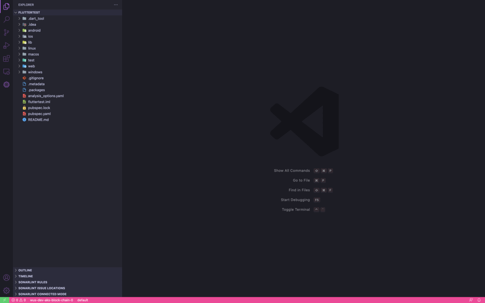

# Flutter MVVM Stacked Architecture 

## Get started

### Initialize Architecture
Initialize the project with the MVVM architecture:

### Create View
The create view command will add a View, a ViewModel and the responsive variants for Tablet, Mobile and Desktop.

### Create Widget
This command will create a Widget in the lib/ui/widgets folder with the initial boilerplate and responsive variants.

This VS code extension is the extenstion of the older [provider architechture](https://github.com/madhukesh048/Flutter-MVVM-VS-Code-extension-Pack)

